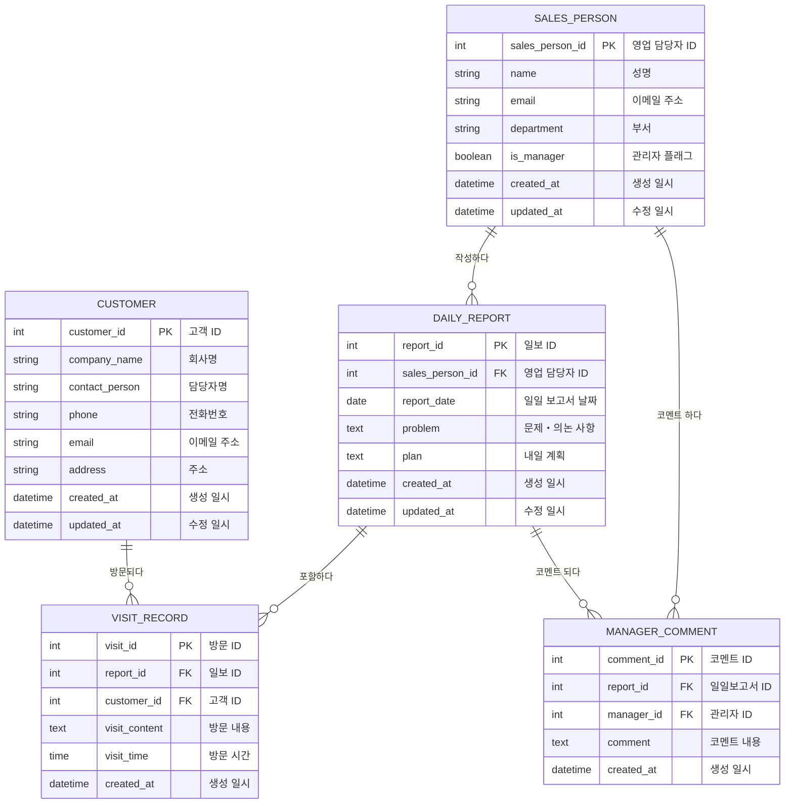

```mermaid
erDiagram
    %% 영업 마스터
    SALES_PERSON {
        int sales_person_id PK "영업 담당자 ID"
        string name "성명"
        string email "이메일 주소"
        string department "부서"
        boolean is_manager "관리자 플래그"
        datetime created_at "생성 일시"
        datetime updated_at "수정 일시"
    }

    %% 고객 마스터
    CUSTOMER {
        int customer_id PK "고객 ID"
        string company_name "회사명"
        string contact_person "담당자명"
        string phone "전화번호"
        string email "이메일 주소"
        string address "주소"
        datetime created_at "생성 일시"
        datetime updated_at "수정 일시"
    }

    %% 일일 보고서   
    DAILY_REPORT {
        int report_id PK "일보 ID"
        int sales_person_id FK "영업 담당자 ID"
        date report_date "일일 보고서 날짜"
        text problem "문제・의논 사항"
        text plan "내일 계획"
        datetime created_at "생성 일시"
        datetime updated_at "수정 일시"
    }

    %% 방문 기록
    VISIT_RECORD {
        int visit_id PK "방문 ID"
        int report_id FK "일보 ID"
        int customer_id FK "고객 ID"
        text visit_content "방문 내용"
        time visit_time "방문 시간"
        datetime created_at "생성 일시"
    }

    %% 상사 코멘트
    MANAGER_COMMENT {
        int comment_id PK "코멘트 ID"
        int report_id FK "일일보고서 ID"
        int manager_id FK "관리자 ID"
        text comment "코멘트 내용"
        datetime created_at "생성 일시"
    }

    %% 관계 정의
    SALES_PERSON ||--o{ DAILY_REPORT : "작성하다"
    DAILY_REPORT ||--o{ VISIT_RECORD : "포함하다"
    CUSTOMER ||--o{ VISIT_RECORD : "방문되다"
    DAILY_REPORT ||--o{ MANAGER_COMMENT : "코멘트 되다"
    SALES_PERSON ||--o{ MANAGER_COMMENT : "코멘트 하다"
```
