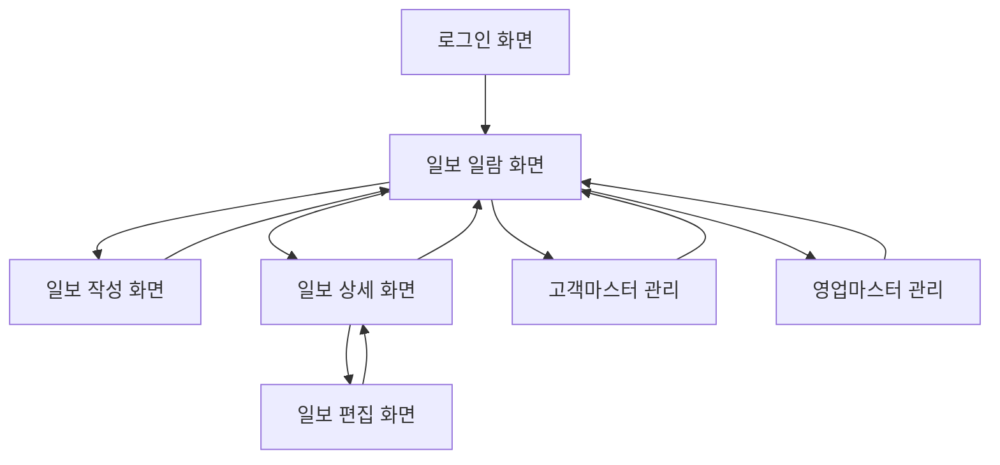

# 일일보고 시스템 화면 정의서

## 1. 화면 목록

| 화면 ID | 화면 이름 | 개요 | 사용자 |
|---------| ------------------ | ------------------------ | ---------- |
| SC001   | 로그인 화면 | 시스템에 로그인 | 모든 사용자 |
| SC002   | 일보 일람 화면 | 일보 일람 표시 및 검색 | 모든 사용자 |
| SC003   | 일보 작성 화면 | 신규 일보 작성 | 영업 담당자 |
| SC004   | 일보 편집 화면 | 기존 일보 편집 | 영업 담당자 |
| SC005   | 일보 상세 화면 | 일보 상세 표시 · 코멘트 | 모든 사용자 |
| SC006   | 고객 마스터 관리 화면 | 고객 정보 관리 | 관리자 |
| SC007   | 영업 마스터 관리 화면 | 영업 담당자 관리 | 관리자 |

## 2. 화면 상세  

### 2.1 로그인 화면(SC001)  

#### 화면 레이아웃  


```
+----------------------------------+  
|         영업일보 시스템          |  
+----------------------------------+  
|                                  |  
|          이메일 주소:            |  
|         [________________]       |  
|                                  |  
|            비밀번호:             |  
|         [________________]       |  
|                                  |  
|              [로그인]            |  
|                                  |  
+----------------------------------+  
``` 

#### 화면 항목

| 항목 이름 | 유형 | 필수 | 설명 |
| -------------- | ------ | ---- | ------------------------ |
| 이메일 주소 | 입력 | ○ | 로그인 이메일 주소 |
| 패스워드 | 입력 | ○ | 패스워드 (마스크 표시) |
| 로그인 버튼 | 버튼 | - | 로그인 처리 실행 |

### 2.2 일보 일람 화면(SC002)

#### 화면 레이아웃

```
+----------------------------------+
영업일보 시스템 [로그아웃] |
+----------------------------------+
| [신규 일보 작성] |
+----------------------------------+
| 검색 조건 |
| 기간: [____/___] ~ [____/___] |
| 영업 담당:[▼선택해 주세요] |
|[검색] |
+----------------------------------+
| 날짜 | 영업 담당자 | 고객 수 | 상태 |
|------|----------|--------|------|
| 7/27 | 야마다 타로 | 3건 | [상세] |
| 7/26 | 야마다 타로 | 5건 | [상세] |
| 7/25 | 다나카 하나코 | 2건 | [상세] |
+----------------------------------+
```

#### 화면 항목

| 항목 이름 | 유형 | 필수 | 설명 |
| ------------ | -------- | ---- | ---------------------------------- |
신규 일보 작성 | 버튼 | - | 일보 작성 화면으로 전환 |
| 기간 (시작) | 날짜 입력 | - | 검색 기간 시작일 |
| 기간(종료) | 날짜 입력 | - | 검색 기간 종료일 |
| 영업 담당 | 선택 | - | 영업 담당자로 필터링 (관리자 전용) |
| 검색 | 버튼 | - | 검색 실행 |
| 일보 일람 | 표 | - | 일보 일람 표시 |
| 상세 | 링크 | - | 일보 상세 화면으로 전환 |

### 2.3 일보 작성 화면(SC003)

#### 화면 레이아웃

```
+----------------------------------+
영업일보 시스템 [로그아웃] |
+----------------------------------+
| 일보 작성 |
+----------------------------------+
| 날짜: 2025/07/27 |
작성자 : 야마다 타로 |
+----------------------------------+
| ■ 방문 기록 |
|[+방문 기록 추가] |
||
| 고객명:[▼선택] |
|방문 시간:[__:__] |
| 방문 내용: |
|[________________________] |
|[________________________] |
|[삭제] |
+----------------------------------+
| ■ 오늘의 과제 · 상담 (Problem) |
|[________________________] |
|[________________________] |
|[________________________] |
||
| ■ 내일 계획 (Plan) |
|[________________________] |
|[________________________] |
|[________________________] |
+----------------------------------+
| [저장] [취소] |
+----------------------------------+
```

#### 화면 항목

| 항목 이름 | 유형 | 필수 | 설명 |
| ------------ | -------------- | ---- | -------------------------- |
| 날짜 | 표시 | - | 오늘 날짜 (자동 설정) |
작성자 | 표시 | - | 로그인 사용자 이름 |
| 방문 기록 추가 | 버튼 | - | 방문 기록 입력란 추가 |
| 고객 이름 | 선택 | ○ | 고객 마스터에서 선택 |
| 방문 시간 | 시간 입력 | - | 방문 시간 (선택 사항) |
| 방문 내용 | 텍스트 영역 | ○ | 방문 내용 (최대 500자) |
| 삭제 | 버튼 | - | 해당 방문 기록 삭제 |
| 과제·상담 | 텍스트 영역 | ○ | 오늘의 과제(최대 1000자) |
| 내일 계획 | 텍스트 영역 | ○ | 내일 계획 (최대 1000자) |
| 저장 | 버튼 | - | 일보 저장 |
| 취소 | 버튼 | - | 목록 화면으로 돌아가기 |

### 2.4 일보 편집 화면(SC004)

#### 화면 레이아웃

※ 일보 작성 화면과 동일（기존 데이터가 표시됨）

#### 画面項目

※ 일보 작성 화면과 동일

### 2.5 일보 상세 화면（SC005）

#### 화면 레이아웃

```
+----------------------------------+
영업일보 시스템 [로그아웃] |
+----------------------------------+
| 일보 상세 |
+----------------------------------+
| 날짜: 2025/07/27 |
작성자 : 야마다 타로 |
|[편집](작성자만 표시) |
+----------------------------------+
| ■ 방문 기록 |
| 1. ABC 상사 (10:00) |
| 신상품의 제안을 실시. |
| 다음 번 견적 제출 예정. |
|                                  |
| 2. XYZ 산업 (14:00) |
| 기존 시스템의 유지 보수 상담. |
+----------------------------------+
| ■ 오늘의 과제 · 상담 (Problem) |
| · 신규 개척의 진행이 늦어지고 있습니다 |
| · 경쟁사의 동향에 대한 정보 수집 |
|                                  |
| ■ 내일 계획 (Plan) |
| · ABC 상사에 대한 견적 작성 |
| · 신규 목록 50 건에 전화 접근 |
+----------------------------------+
| ■ 상장 코멘트 |
| 다나카 부장(7/27 18:00)： |
| 신규 개척에 대해서는 내일 상담합니다 |
| 생강. |
|                                   |
|[댓글 추가](관리자 전용) |
|[________________________] |
|[투고] |
+----------------------------------+
|[뒤로] |
+----------------------------------+
```

#### 화면 항목

| 항목 이름 | 유형 | 필수 | 설명 |
| ------------ | -------------- | ---- | ---------------------------- |
| 편집 | 버튼 | - | 편집 화면으로 전환 (작성자 전용) |
| 방문 기록 | 표시 | - | 방문 기록 일람 |
| 과제 · 상담 | 표시 | - | 기재 내용 표시 |
| 내일 계획 | 표시 | - | 기재 내용 표시 |
| 코멘트 일람 | 표시 | - | 상장 코멘트의 이력 |
| 코멘트 입력 | 텍스트 영역 | ○ | 코멘트 입력 (관리자 전용) |
| 게시 | 버튼 | - | 코멘트 게시 (관리자 전용) |
| 뒤로 | 버튼 | - | 목록 화면으로 돌아가기 |

### 2.6 고객 마스터 관리 화면(SC006)

#### 화면 레이아웃

```
+----------------------------------+
| 영업일보 시스템 [로그아웃] |
+----------------------------------+
| 고객 마스터 관리 |
+----------------------------------+
| [신규 등록] |
+----------------------------------+
| 검색: [_______________] [검색] |
+----------------------------------+
| 회사명 | 담당자 | 전화 | 운영 |
|--------|---------|------|--------|
| ABC 상사 | 사토 이치로 | 03-xx | [편집] |
| XYZ 산업 | 스즈키 지로 | 06-xx | [편집] |
+----------------------------------+
```

#### 화면 항목

| 항목 이름 | 유형 | 필수 | 설명 |
| -------- | ------ | ---- | -------------------------- |
| 신규 등록 | 버튼 | - | 고객 신규 등록 대화 상자 표시 |
| 검색 | 입력 | - | 회사 이름 / 담당자 이름으로 검색 |
| 고객 목록 | 표 | - | 고객 정보 목록 |
| 편집 | 버튼 | - | 고객 정보 편집 대화 상자 표시 |

### 2.7 영업 마스터 관리 화면(SC007)

#### 화면 레이아웃

```
+----------------------------------+
영업일보 시스템 [로그아웃] |
+----------------------------------+
| 영업 담당자 관리 |
+----------------------------------+
| [신규 등록] |
+----------------------------------+
|이름 |메일 |부서 |권한 |조작 |
|------|---------|------|------|------|
| 야마다 | yamada@ | 영업 1 | 일반 | [편집] |
| 다나카 | tanaka@ | 영업 1| 관리 |[편집]|
+----------------------------------+
```

#### 화면 항목

| 항목 이름 | 유형 | 필수 | 설명 |
| -------------- | ------ | ---- | ---------------------------- |
| 신규 등록 | 버튼 | - | 영업 담당자 등록 대화 상자 표시 |
| 영업 담당자 목록 | 표 | - | 영업 담당자 목록 |
| 편집 | 버튼 | - | 영업 담당자 편집 대화 상자 표시 |

## 3. 화면 천이도



## 4. 권한으로 표시 제어

### 4.1 영업 담당자(일반)

- 자신의 일보만 작성·편집·열람 가능
- 타인의 일보는 열람만 가능
- 마스터 관리 화면에 액세스 불가

### 4.2 관리자

- 모든 일보의 열람·댓글 가능
- 일보의 작성·편집은 자신의 것만
- 마스터 관리 화면에 액세스 가능

## 5. 밸리데이션 일람

| 화면 | 항목 | 유효성 검사 |
| -------- | -------------- | ------------------ |
| 로그인 | 이메일 주소 | 필수, 이메일 형식 |
| 로그인 | 암호 | 필수, 8자 이상 |
| 일보 작성 | 방문 내용 | 필수, 최대 500자 |
| 일보 작성 | 과제 · 상담 | 필수, 최대 1000자 |
| 일보 작성 | 내일 계획 | 필수, 최대 1000자 |
| 일보 상세 | 코멘트 | 필수, 최대 500자 |

## 6. 오류 메시지

| 오류 유형 | 메시지 |
| -------------- | ------------------------------------------------ |
|필수 오류 |{항목 이름}은 필수 항목입니다 |
|문자수 초과 | {항목명}은 {최대문자수}문자 이내로 입력하십시오 |
| 중복 오류 | 동일한 날짜의 일보가 이미 존재합니다 |
| 권한 오류 | 이 작업을 수행할 권한이 없습니다 |
| 로그인 오류 | 이메일 주소 또는 비밀번호가 잘못되었습니다 |